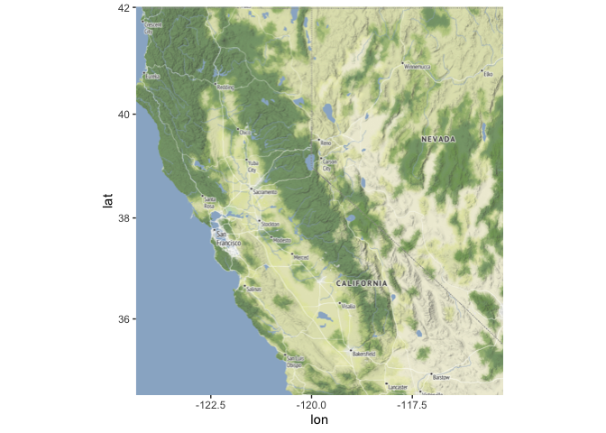
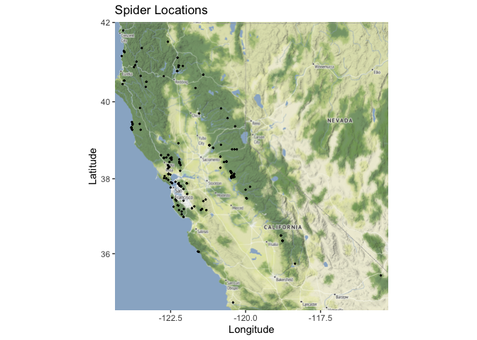
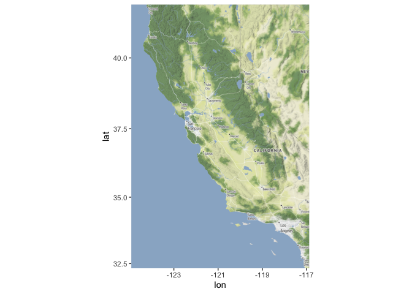
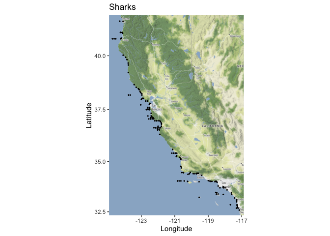
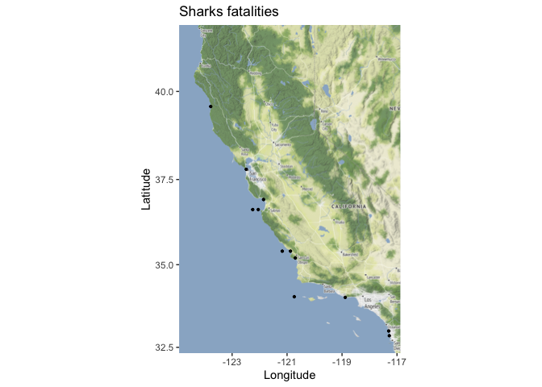

## Learning Goals
*At the end of this exercise, you will be able to:*  
1. Produce distribution maps in R.  
 
## Resources
[Overview of Cooordinate Reference Systems in R](https://www.nceas.ucsb.edu/~frazier/RSpatialGuides/OverviewCoordinateReferenceSystems.pdf)
[ggmap](https://cran.r-project.org/web/packages/ggmap/readme/README.html)

## Spatial Data in R
There are many packages and techniques for working with spatial data in R. We will cover just some of the basics. One nice package is `ggmap`, which allows us to use base maps from Google Maps, OpenStreetMap, and Stamen Maps. It also works well with `ggplot2`.  

## Load the libraries

```r
library(tidyverse)
library(janitor)
```

## Install and load the `ggmap` package  

```r
#install.packages("ggmap")
library(ggmap)
```

## Register for a Stamen API Key
Because some of these maps are proprietary, you will need and API key to use them. Google maps are great, but they want you to register and enter payment information even though you get a credit each month for free. We are going to use Stamen maps for now which requires registration, but no payment.  

Start by making an account with [Stadia Maps](https://client.stadiamaps.com/signup/). You need to add a "property" which is just a name for your project. Once you have an account, you can get an API key. Use the following code to register your key.  

```r
register_stadiamaps("e77f55a8-a371-44cd-a7dd-6384b4586d64", write = FALSE)
```

## Load the Data
Let's load our processed data from the first part of the lab.

```r
spiders <- read_csv("data/spiders_with_locs.csv")%>% clean_names()
```

```
## Rows: 270 Columns: 11
## ── Column specification ────────────────────────────────────────────────────────
## Delimiter: ","
## chr (8): Family, Genus, Country, State, County, Locality, Date, Collector
## dbl (3): Accession, Latitude, Longitude
## 
## ℹ Use `spec()` to retrieve the full column specification for this data.
## ℹ Specify the column types or set `show_col_types = FALSE` to quiet this message.
```

There is an error in one of the coordinates that we will fix here.

```r
spiders <- spiders %>% filter(latitude<=42)
```

## Create Base Map
Our goal here is to plot the spiders locations from the columns which contain the latitude and longitude. First, we need to get a base map for plotting our points on. We could plot them without a base map, but that wouldn't give us any context as to where they are in space. To get a base map we specify a min and max of each x and y coordinate, and create a bounding box.  

We set the bounding box to a little outside our min and max locations with `f = 0.05`.    

`summary()` gives us our min and max.

```r
spiders %>% 
  select(latitude, longitude) %>% 
  summary()
```

```
##     latitude       longitude     
##  Min.   :34.67   Min.   :-124.1  
##  1st Qu.:37.88   1st Qu.:-122.5  
##  Median :38.19   Median :-122.1  
##  Mean   :38.47   Mean   :-121.6  
##  3rd Qu.:38.88   3rd Qu.:-120.5  
##  Max.   :41.80   Max.   :-115.5
```

Now we set the bounding box. We use the min and max values for latitude and longitude to set the range.  

```r
lat <- c(34.67, 41.80)
long <- c(-124.1, -115.5)
bbox <- make_bbox(long, lat, f = 0.03) #f is the fraction of the bounding box to add to the range
```

Let's get a base map for our bounding box area. There are several different map [styles](https://docs.stadiamaps.com/themes/)

```r
map1 <- get_stadiamap(bbox, maptype = "stamen_terrain", zoom=7)
```

```
## ℹ © Stadia Maps © Stamen Design © OpenMapTiles © OpenStreetMap contributors.
```

Have a look at the map.  

```r
ggmap(map1)
```

<!-- -->

## Adding Points to Base Map
`ggmap` works well with `ggplot2`. To add our points we only need to specify the x and y location similar to how we made charts in previous labs. 

```r
ggmap(map1) + 
  geom_point(data = spiders, aes(longitude, latitude), size=0.4) +
  labs(x= "Longitude", y= "Latitude", title="Spider Locations")
```

<!-- -->

## Practice
Let's use the shark attack data set from the second midterm and try to visualize where the attacks occurred. The [data](https://catalog.data.gov/dataset/shark-incident-database-california-56167) are from: State of California- Shark Incident Database.  

```r
sharks <- read_csv("data/SharkIncidents_1950_2022_220302.csv") %>% 
  clean_names() %>% 
  filter(longitude !="NA" & latitude !="NA") %>% # pulling out NA locations
  mutate(longitude = as.numeric(longitude)) # converting longitude to numeric
```

```
## Rows: 211 Columns: 16
## ── Column specification ────────────────────────────────────────────────────────
## Delimiter: ","
## chr (12): IncidentNum, Time, County, Location, Mode, Injury, Depth, Species,...
## dbl  (4): Month, Day, Year, Latitude
## 
## ℹ Use `spec()` to retrieve the full column specification for this data.
## ℹ Specify the column types or set `show_col_types = FALSE` to quiet this message.
```

1. Use the range of the latitude and longitude to build an appropriate bounding box for your map. But, first run the following chunk to get rid of duplicate locations. This will make the map look cleaner.

```r
sharks_dups <- sharks %>% 
  distinct(location, .keep_all = TRUE) # remove duplicate locations, but keep the remaining variables
```


```r
sharks_dups%>% 
  select(latitude, longitude) %>% 
  summary()
```

```
##     latitude       longitude     
##  Min.   :32.59   Min.   :-124.7  
##  1st Qu.:34.04   1st Qu.:-122.6  
##  Median :36.55   Median :-121.8  
##  Mean   :36.13   Mean   :-121.1  
##  3rd Qu.:37.63   3rd Qu.:-119.5  
##  Max.   :41.56   Max.   :-117.1
```


```r
lat <- c(32.59, 41.56)
long <- c(-124.7, -117.1)
bbox <- make_bbox(long, lat, f = 0.03)
```

2. Load a map from `stamen` in a terrain style projection and display the map.

```r
map2 <- get_stadiamap(bbox, maptype = "stamen_terrain", zoom=7)
```

```
## ℹ © Stadia Maps © Stamen Design © OpenMapTiles © OpenStreetMap contributors.
```


```r
ggmap(map2)
```

<!-- -->

3. Build a map that overlays the recorded observations of shark attacks in California.

```r
ggmap(map2) + 
  geom_point(data = sharks_dups, aes(longitude, latitude), size=0.4) +
  labs(x= "Longitude", y= "Latitude", title="Sharks")
```

<!-- -->

4. What if you only wanted to map the fatalities?

```r
sharks_fatal <- sharks_dups %>% 
  filter(injury=="fatal")
```


```r
sharks_fatal %>% 
  select(latitude, longitude) %>% 
  summary()
```

```
##     latitude       longitude     
##  Min.   :32.85   Min.   :-123.8  
##  1st Qu.:34.03   1st Qu.:-122.1  
##  Median :35.40   Median :-121.0  
##  Mean   :35.62   Mean   :-120.8  
##  3rd Qu.:36.70   3rd Qu.:-120.2  
##  Max.   :39.58   Max.   :-117.3
```


```r
lat3 <- c(32.85, 39.58)
long3 <- c(-123.8, -117.3)
bbox3 <- make_bbox(long, lat, f = 0.03)
```


```r
map3 <- get_stadiamap(bbox, maptype = "stamen_terrain", zoom=7)
```

```
## ℹ © Stadia Maps © Stamen Design © OpenMapTiles © OpenStreetMap contributors.
```


```r
ggmap(map3) + 
  geom_point(data = sharks_fatal, aes(longitude, latitude), size=0.8) +
  labs(x= "Longitude", y= "Latitude", title="Sharks fatalities")
```

<!-- -->

## Wrap-up  
Please review the learning goals and be sure to use the code here as a reference when completing the homework.

-->[Home](https://jmledford3115.github.io/datascibiol/)
