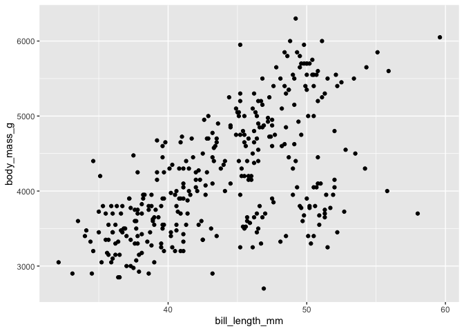
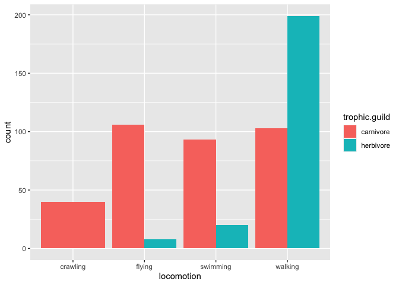
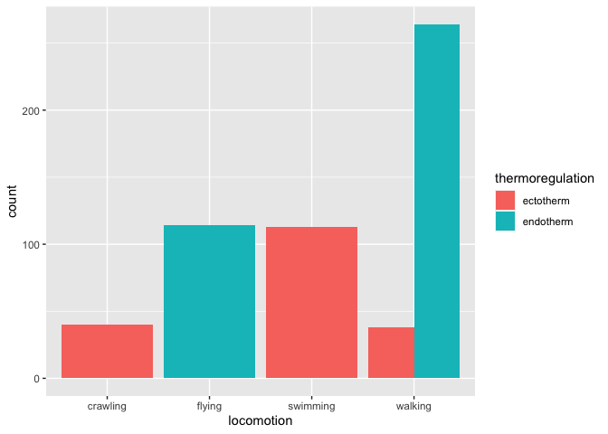

## Learning Goals

*At the end of this exercise, you will be able to:*
1. Understand the basic building blocks of a shiny app.  
2. Understand how shiny works with user inputs to build outputs.  

## Resources

-   [Shiny Main Page](https://shiny.rstudio.com/gallery/)
-   [Mastering Shiny](https://mastering-shiny.org/basic-app.html)

## Shiny

Shiny is an R package which makes it easy to design interactive web applications without knowing any html, css, or java script. First we need to make sure we have shiny installed and loaded.


We will also need the `tidyverse` and `palmerpenguins` to run the examples.


```
#> ── Attaching core tidyverse packages ──────────────────────── tidyverse 2.0.0 ──
#> ✔ dplyr     1.1.4     ✔ readr     2.1.4
#> ✔ forcats   1.0.0     ✔ stringr   1.5.1
#> ✔ ggplot2   3.4.4     ✔ tibble    3.2.1
#> ✔ lubridate 1.9.3     ✔ tidyr     1.3.0
#> ✔ purrr     1.0.2     
#> ── Conflicts ────────────────────────────────────────── tidyverse_conflicts() ──
#> ✖ dplyr::filter() masks stats::filter()
#> ✖ dplyr::lag()    masks stats::lag()
#> ℹ Use the conflicted package (<http://conflicted.r-lib.org/>) to force all conflicts to become errors
```

## Shiny Example

Shiny apps can be designed to do almost anything you can imagine. They are very useful for making specialized tools for specific needs in business and research, or just for fun! Let's run a basic example on our computer. Type the following into the R console. You should have the file `plot_iris.R` in your working directory. Use the drop down menus to change the x and y axes on the plot.


```r
runApp("plot_iris.R")
```

## Shiny App Skeleton

A shiny app consists of a user interface (ui) function, server function, and run function.

1.  The `ui` function controls the user inputs and the way the app will be displayed; i.e. this controls how your app looks.  
2.  The `server` function is the part of the app which takes the values of the user inputs, performs calculations and/or makes plots, and prepares the outputs for display; i.e. this controls how your app works.
3.  The `run` function combines the ui and server function to run the app.  

Below is a bare bones shiny app. You can get this code snippet by typing `shinyapp`. It doesn't do anything because we haven't created any inputs with the ui or any outputs with the server.  

```r
library(shiny)

ui <- fluidPage(
  
)

server <- function(input, output, session) {
  
}

shinyApp(ui, server)
```

For the rest of the lab we will work on building an example app using `palmerpenguins`.

## Shiny Inputs

There are many types of inputs in shiny, see the [shiny cheat sheet](https://shiny.rstudio.com/images/shiny-cheatsheet.pdf). Our example app uses `selectInput()`, which takes a set of predefined choices and supplies them to the user in a drop down menu format. We are working with the `palmerpenguins` data set, so we want the selections to be the column names of the data frame.

Let's get the names of the `palmerpenguins` data frame and add them as a `selectInput()` to our ui. `selectInput()` takes several arguments including the label that the server function will use, the label that will display to the user, the selection choices, and the initially selected choice.

```r
names(penguins)
#> [1] "species"           "island"            "bill_length_mm"   
#> [4] "bill_depth_mm"     "flipper_length_mm" "body_mass_g"      
#> [7] "sex"               "year"
```


Since we will make a scatterplot, let's focus on the continuous variables. The first step is to setup the x variable input.

```r
ui <- fluidPage(
    selectInput("x", "Select X Variable", choices = c("bill_length_mm", "bill_depth_mm", "flipper_length_mm", "body_mass_g"), selected = "bill_length_mm")
)

server <- function(input, output) {
  
}

shinyApp(ui, server)
```

Let's repeat the process for the y variable input.

```r
ui <- fluidPage(
  
    selectInput("x", "Select X Variable", choices = c("bill_length_mm", "bill_depth_mm", "flipper_length_mm", "body_mass_g"), selected = "bill_length_mm"),
    

    
)

server <- function(input, output) {
  
}

shinyApp(ui, server)
```

## Server Side

Great, we now have our user inputs set up! Next we need to work with those inputs so R can make the plot. This can be the tricky part. The processing is done in the server function. The ui passes the names of our choices via an object called `inputs` to the server function. We need to access our inputs by their names with the `$` symbol. To get the x input we type `input$x` and y is `input$y`.

All reactive inputs need to be wrapped in a reactive environment called a reactive function. Reactivity is the core of shiny. Let's wrap our reactive input values in a reactive function on the server side and run our app as a test. What happens? Are we doing anything with the inputs yet? What happens if you remove the reactive function from the server side and run the app?


```r
ui <- fluidPage(
  
    selectInput("x", "Select X Variable", choices = c("bill_length_mm", "bill_depth_mm", "flipper_length_mm", "body_mass_g"), 
              selected = "bill_length_mm"),
    
    selectInput("y", "Select Y Variable", choices = c("bill_length_mm", "bill_depth_mm", "flipper_length_mm", "body_mass_g"), 
              selected = "bill_length_mm")
)

server <- function(input, output) {
  reactive({input$x
            input$y})
}

shinyApp(ui, server)
```

## Shiny Outputs

So we have our inputs in a reactive environment, but we want to actually use those inputs to make a plot and display it on the ui. To make and display the plot, we need to save it to a named output object that the ui can use. To do this we use the reactive expression `renderPlot()` and access the plot on the ui side with `plotOutput()`. The inputs from `selectInput()` are character strings, so we need to use `aes_string()` in `ggplot`.


```r
penguins %>% 
  ggplot(aes(x=bill_length_mm, y=body_mass_g))+
  geom_point()
#> Warning: Removed 2 rows containing missing values (`geom_point()`).
```

<!-- -->


```r
ui <- fluidPage(
  
    selectInput("x", "Select X Variable", choices = c("bill_length_mm", "bill_depth_mm", "flipper_length_mm", "body_mass_g"), 
              selected = "bill_length_mm"),
    
    selectInput("y", "Select Y Variable", choices = c("bill_length_mm", "bill_depth_mm", "flipper_length_mm", "body_mass_g"), 
              selected = "bill_length_mm"),
    
    plotOutput("plot", width="500px", height="400px") #providing size/aspect of visual
)

server <- function(input, output) {
  
  output$plot <- renderPlot({
    
        ggplot(data=penguins, aes_string(x=input$x, y=input$y, color="species"))+
      geom_point()+
      theme_light(base_size=18)
    
  })
  
}

shinyApp(ui, server)
```

Congratulations, you made your first shiny app!

## Practice

1.  Let's work with the homerange data again, just to keep things consistent. Please load the data as a new object `homerange` and have a look at the column names.  

```
#> Rows: 569 Columns: 24
#> ── Column specification ────────────────────────────────────────────────────────
#> Delimiter: ","
#> chr (16): taxon, common.name, class, order, family, genus, species, primarym...
#> dbl  (8): mean.mass.g, log10.mass, mean.hra.m2, log10.hra, dimension, preyma...
#> 
#> ℹ Use `spec()` to retrieve the full column specification for this data.
#> ℹ Specify the column types or set `show_col_types = FALSE` to quiet this message.
```


```r
names(homerange)
#>  [1] "taxon"                      "common.name"               
#>  [3] "class"                      "order"                     
#>  [5] "family"                     "genus"                     
#>  [7] "species"                    "primarymethod"             
#>  [9] "N"                          "mean.mass.g"               
#> [11] "log10.mass"                 "alternative.mass.reference"
#> [13] "mean.hra.m2"                "log10.hra"                 
#> [15] "hra.reference"              "realm"                     
#> [17] "thermoregulation"           "locomotion"                
#> [19] "trophic.guild"              "dimension"                 
#> [21] "preymass"                   "log10.preymass"            
#> [23] "PPMR"                       "prey.size.reference"
```


```r
homerange %>% 
  ggplot(aes(x=locomotion, fill=trophic.guild))+
  geom_bar(position="dodge")
```

<!-- -->


```r
homerange %>% 
  ggplot(aes(x=locomotion, fill=thermoregulation))+
  geom_bar(position="dodge")
```

<!-- -->


2.  Build a shiny app that produces a barplot that explores `locomotion` type with a fill reaction for the variables `trophic.guild` and `thermoregulation`.

```r
ui <- fluidPage(
  
    radioButtons("x", "Select Fill Variable", choices = c("trophic.guild", "thermoregulation"), selected= "trophic.guild"),
    
    plotOutput("plot")
)

server <- function(input, output, session) {
  
  output$plot <- renderPlot({
    
        ggplot(data=homerange, aes_string(x="locomotion", fill=input$x))+
      geom_bar(position="dodge", alpha=0.8, color="black")+
      labs(x=NULL, fill="Fill Variable")
    
  })
  
}

shinyApp(ui, server)
```


```{=html}
<div style="width: 100% ; height: 400px ; text-align: center; box-sizing: border-box; -moz-box-sizing: border-box; -webkit-box-sizing: border-box;" class="muted well">Shiny applications not supported in static R Markdown documents</div>
```


## Packages for next time

Please install shinydashboard below for part 2!


```r
#install.packages("shinydashboard")
```

## That's it, let's take a break!

--\>[Home](https://jmledford3115.github.io/datascibiol/)
